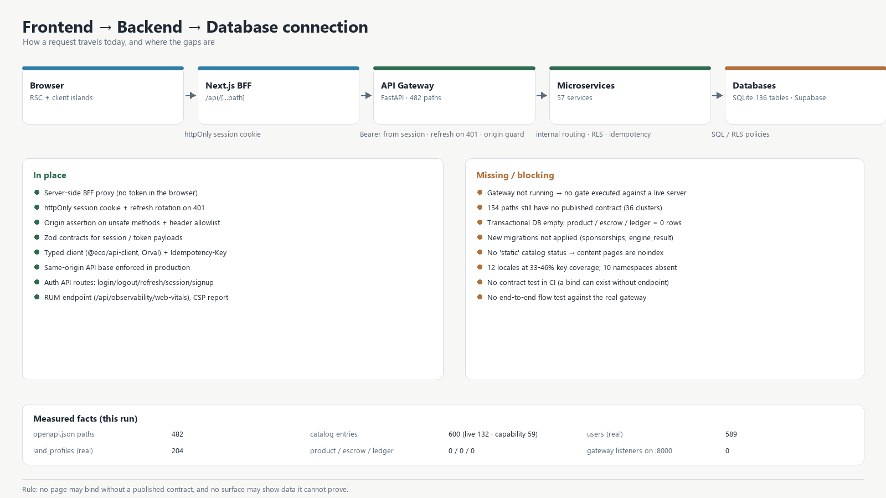

# تغییرات جدید + برنامهٔ اتصال فرانت‌اند به بک‌اند و دیتابیس

**تاریخ:** ۲۰۲۶/۰۹/۲۸ · **روش:** مطالعهٔ مجدد مخزن (git، زمان فایل‌ها، کاتالوگ، کد BFF، سنجش دیتابیس)
**پیشین:** `docs/frontend/FRONTEND_GAP_ANALYSIS.md` · `docs/frontend/FRONTEND_ROADMAP.md`

---

## ۱) تغییرات جدید از آخرین مطالعه (چه چیزی عوض شد)

### ۱.۱ کامیت‌های تازه (آخرین ۱۲)
| کامیت | موضوع |
|---|---|
| `5d8e98b` | `docs: refresh master dashboard head` |
| `44fd64c` | `docs: record catalog and agent shutdown checkpoints` |
| `42ade22` | `docs: add master frontend status and 600-page checklist` |
| `b03dec5` | `feat(frontend): add measured 600-path page catalog` |
| `3683725` | `feat(marketplace): bind orphan commerce routes to live contracts` |
| `d81c34a` | `refactor(frontend): centralize canonical site URL plumbing` |
| `4e0ee59` | `docs: record tier 0 workspace completion` |
| `3c1d641` | `feat(frontend): add tier 0 admin research and workspace surfaces` |
| `21673b7` | `feat(frontend): bind marketplace and public pages to live contracts` |
| `e98d706` | `fix(auth): enforce refresh rotation and canonical API contract` |
| `16b32ab` | `build(frontend): add production container and kubernetes base` |
| `5088ef5` | `ci: enforce main-branch releases and frontend quality gates` |

### ۱.۲ تغییرات درختِ کار (هنوز کامیت‌نشده: **۵۴۹ فایل**)
- **بک‌اند/دادگان:** `database/models.py`، مهاجرت‌های تازه `alembic/versions/20260926_020000_sponsorships.py` و `20260927_010000_engine_result_tables.py`، `engine/hydroma/biofertilizer/models.py`.
- **فرانت‌اند:** رجیستری کاتالوگ بازتولید شد، صفحات تازه `design-system/components`، `learn/manual/sites`، `learn/content/search`، کامپوننت‌های `surface/NoJsSearch.tsx` و `market/MarketplaceTemplatePage.tsx`، تست‌های `i18n/gate-negative` و `design-system.audit`.
- **محتوا:** مجموعهٔ «کتاب‌ها» (HP-*) در حال بازبینی/بازنویسی + بکاپ‌ها.
- **مستندات تازه:** `docs/ENGINEERING_INDEX_FA.md`، ۷ سند برنامهٔ فرانت‌اند، `CONTRACT_REQUEST_154.md`، `DESIGN_SYSTEM.md`، و گزارش‌های موتور/کتاب‌ها/اسپانسر/WBI/Q1-Q2.

### ۱.۳ آنچه **تغییر نکرده** (سنجش زنده)
| سنجه | مقدار امروز | مقدار قبلی |
|---|---|---|
| ورودی‌های کاتالوگ | ۶۰۰ | ۶۰۰ |
| `live` / `capability` | ۱۳۲ / ۵۹ | ۱۳۲ / ۵۹ |
| `planned` / `unavailable` | ۲۵۵ / ۱۵۴ | ۲۵۵ / ۱۵۴ |
| وضعیت `static` در قاعدهٔ کاتالوگ | **هنوز اضافه نشده** | — |
| مسیرهای `openapi.json` | **۴۸۲** | ۴۴۵ (openapi_schema.json) |
| بک‌اند در حال اجرا | **خیر** (هیچ listener روی ۸۰۰۰) | خیر |

---

## ۲) معماری فعلی اتصال (آنچه ساخته شده و درست است)

نقطهٔ قوت واقعی پروژه: اتصال از **سمت سرور** انجام می‌شود، نه از مرورگر با توکن.

| جزء | فایل | نقش |
|---|---|---|
| پروکسی BFF | `app/api/[...path]/route.ts` | همهٔ متدها را به `/api/<path>` بک‌اند می‌فرستد؛ `Authorization: Bearer` از نشست سرور تزریق می‌شود |
| بازآوری نشست | همان فایل + `lib/bff/auth-service.ts` | روی `401` یک‌بار refresh می‌کند و در صورت شکست کوکی را پاک می‌کند |
| محافظ درخواست | `lib/bff/backend.ts` | بررسی `Origin` برای متدهای نوشتنی + allowlist هدر + `Cache-Control: private, no-store` |
| قرارداد نشست | `lib/bff/contracts.ts` | اسکیمای Zod برای `sessionUser` و `tokenResponse` |
| کوکی/نشست | `lib/session/session-cookie.ts` | شناسهٔ نشست، TTL از `SESSION_TTL_SECONDS` |
| کلاینت تایپ‌شده | `lib/api/client.ts` + `@eco/api-client` | base هم‌مبدأ (`/api`)؛ در تولید اجبار به same-origin؛ تولید `Idempotency-Key` |
| مسیرهای API داخلی | `api/auth/{login,logout,refresh,session,signup}`، `api/csp-report`، `api/observability/web-vitals` | — |
| محیط | `lib/config/server-env.ts` / `public-env.ts` | `API_PROXY_TARGET`، `NEXT_PUBLIC_APP_URL`، `REDIS_URL`، الزام HTTPS در تولید |

**جریان درخواست:** مرورگر → `/api/...` (Next BFF) → `API_PROXY_TARGET` (دروازهٔ FastAPI) → سرویس میکرو → دیتابیس.

---

## ۳) شکاف‌های اتصال (آنچه مانع «اتصال واقعی» است)

| # | شکاف | شاهد | اثر |
|---|---|---|---|
| ۱ | بک‌اند اجرا نمی‌شود و هیچ دروازه‌ای در برابر gateway زنده اجرا نشده | هیچ listener روی ۸۰۰۰؛ `PAGE_GATES.md` صریح می‌گوید «هیچ دروازه‌ای اجرا نشده» | ادعای اتصال، تأیید اجرایی ندارد |
| ۲ | قرارداد منتشرنشده | `CONTRACT_REQUEST_154.md` (۳۶ خوشه: ۵۲ علمی، ۱۹ بازارچه، ۱۱ محصول، ۹ جست‌وجو…) | ۱۵۴ مسیر قابل bind نیست |
| ۳ | دیتابیس تراکنشی خالی است | `econojin.db`: **users 589، land_profiles 204** (واقعی) اما `product/carbon_projects/ecotransaction/fin_journal_entry/mrvobservation = 0` | بازارگاه/کربن/MRV/مالی داده ندارند |
| ۴ | قاعدهٔ کاتالوگ، محتوای ثابت را noindex می‌کند | نبود وضعیت `static` | ~۲۰ صفحهٔ واقعی از فهرست خارج‌اند |
| ۵ | ترجمهٔ ۱۲ زبان ناقص | اندازه‌گیری: ۳۳–۴۶٪ کلید؛ ۱۰ فضانام گمشده | تجربهٔ چندزبانه نصفه |
| ۶ | مهاجرت‌های تازه اجرا نشده‌اند | `20260926_sponsorships`، `20260927_engine_result_tables` در `alembic/versions`، اما DB قدیمی | جدول‌های اسپانسر/نتیجهٔ موتور وجود ندارند |

---

## ۴) برنامهٔ اجرایی اتصال فرانت‌اند → بک‌اند → دیتابیس

### فاز A — راه‌اندازی و راستی‌آزمایی زنده (۲ روز)
| گام | فرمان/کار | معیار پذیرش |
|---|---|---|
| A1 | `alembic upgrade head` روی `econojin.db` | جدول‌های اسپانسر و `engine_result*` ساخته شوند؛ `alembic current` = head |
| A2 | راه‌اندازی دروازه: `uvicorn services.api_gateway.main:app --port 8000` | `/api/v1/platform/health` → `operational` |
| A3 | تنظیم محیط فرانت: `API_PROXY_TARGET=http://127.0.0.1:8000`، `NEXT_PUBLIC_APP_URL=http://localhost:3001` | `pnpm dev` بالا بیاید و `/api/...` پاسخ بدهد |
| A4 | اجرای دروازه‌های `PAGE_GATES.md` (MKT-G1…) در برابر gateway زنده و **ثبت نتیجه** | هر دروازه: pass/fail با تاریخ و کامیت |

### فاز B — خط لولهٔ قرارداد (۳ روز)
| گام | کار | معیار |
|---|---|---|
| B1 | بازتولید `openapi.json` از دروازهٔ زنده و مقایسه با فایل مخزن | اختلاف صفر یا PR آگاهانه |
| B2 | `pnpm --filter @eco/web generate:api` (Orval) → `@eco/api-client` | کلاینت هم‌سنخ با ۴۸۲ مسیر؛ `type-check` سبز |
| B3 | تست قرارداد در CI: وجود هر endpoint مصرف‌شده در `openapi.json` | هر bind بدون قرارداد، CI را رد کند |
| B4 | پیگیری `CONTRACT_REQUEST_154.md` | ۳۶ خوشه: یا منتشر شود یا رسماً `noindex` بماند |

### فاز C — اتصال سطح‌به‌سطح (ماتریس آمادگی)

| سطح | endpoint؟ | دادهٔ DB؟ | FE | اقدام |
|---|---|---|---|---|
| احراز/نشست | ✅ | ۵۸۹ کاربر واقعی | ✅ BFF | اجرای دروازهٔ ورود/refresh/rate-limit |
| عمومی (خواندنی) | ✅ | محتوا موجود | live ۷۹ | راستی‌آزمایی هر صفحه با gateway زنده |
| بازارگاه خواندنی | جزئی | **۰ محصول** | live ۱۷+۷ | تصمیم: وارد کردن دادهٔ واقعی پایلوت یا حالت خالی صادقانه |
| بازارگاه نوشتنی/امانت | جزئی | `com_order/escrow_records` = ۰ | جزئی | bind + تست `Idempotency-Key` + جریان خرید |
| مالی/دفتر | جزئی | `fin_account`=۲، بقیه ۰ | ۱۴ | bind + تست بستن دوره |
| علمی (۵۲ ابزار) | ❌ | `engine_result*` تازه | capability ۵۱ | build هستهٔ C++ + انتشار قرارداد اجرا |
| تحلیل‌ها | ✅ (`require_user`) | `analytics_snapshots` | ۶ | bind با نشست، نه صفحهٔ عمومی |
| ادمین/ورک‌اسپیس | ✅ | `admin_audit_logs`, `content_*` | ۸+۱۴ | گسترش با نقش‌محوری |

### فاز D — دادهٔ واقعی دیتابیس (بدون دادهٔ ساختگی)
| گام | کار | معیار |
|---|---|---|
| D1 | فهرست جدول‌های خالیِ مؤثر بر هر سطح | جدول «جدول → endpoint → صفحه» |
| D2 | برای پایلوت: ورود داده‌های **واقعی عملیاتی** (کاربر، پروفایل زمین، محصول تعاونی) | هر رکورد منبع و تاریخ داشته باشد |
| D3 | جایی که دادهٔ واقعی نیست → **حالت خالی صادقانه** با گام بعدی | صفر دادهٔ نمایشی |
| D4 | مهاجرت SQLite → Postgres برای تولید (اگر تصمیم بگیرید) | اسکریپت مهاجرت + تست داده |

### فاز E — جریان‌های سرتاسری و مشاهده‌پذیری (۵ روز)
| جریان | مسیر | معیار |
|---|---|---|
| ورود→نشست→خروج | `/api/auth/*` | refresh rotation؛ کوکی پاک پس از انقضا |
| خرید بازارگاه | مرور→سبد→امانت→کلید یکتا→تحویل→تسویه | مبالغ در هر گام تطبیق داشته باشند |
| زمین علمی | پروفایل زمین→ابزار→نتیجه با بازهٔ عدم‌قطعیت | منبع و نسخهٔ مدل در خروجی |
| مشاهده‌پذیری | `/api/observability/web-vitals` + لاگ خطای API | داشبورد زمان پاسخ و نرخ خطا |

### فاز F — بستن شکاف باقی‌مانده (۶ سپرینت)
هم‌راستا با `FRONTEND_ROADMAP.md`: ابتدا وضعیت `static`، سپس ترجمه، سپس بازارگاه نوشتنی، سپس ابزارهای علمی، سپس ادمین/پژوهش.

---

## ۵) معیار پذیرش نهایی «اتصال واقعی»

۱) دروازه روی ۸۰۰۰ بالا و هر صفحهٔ `live` یک درخواست واقعی موفق نشان می‌دهد.
۲) صفر bind بدون قرارداد (CI آن را رد می‌کند).
۳) هر سطح: جدول‌های دیتابیسش موجود، مهاجرت‌ها در head، و حالت خالی صادقانه در نبود داده.
۴) هر جریان کلیدی یک تست E2E در برابر gateway زنده دارد و نتیجهٔ آن ثبت شده.
۵) `openapi.json` و `@eco/api-client` هم‌سنخ‌اند.

---

## ۶) گام‌های همین هفته (به ترتیب)

1. **A1** مهاجرت‌ها را روی دیتابیس اجرا کن (جدول‌های تازه ساخته شوند).
2. **A2/A3** دروازه را بالا بیاور و فرانت را به آن وصل کن.
3. **A4** دروازه‌های `PAGE_GATES.md` را زنده اجرا و نتیجه را ثبت کن.
4. **B1/B2** بازتولید `openapi.json` و کلاینت Orval.
5. **D1** جدول «جدول دیتابیس → endpoint → صفحه» را بساز تا معلوم شود کدام سطح دادهٔ واقعی دارد.

---

## پیوست — هم‌راستایی با اسناد موجود

| سند | رابطه |
|---|---|
| `docs/ENGINEERING_INDEX_FA.md` | نقطهٔ ورود مستندات؛ این سند مکمل آن است |
| `reports/WAVE_3_INTEGRATION_PLAN_FA_2026-09-26.md` | ادغام بک‌اند/موتور (۱۸ محور)؛ فازهای A–E با آن تعارضی ندارند |
| `reports/OPEN_ITEMS_FA_2026-09-26.md` | دو قلم باز (فرمول nojin، مهاجرت معماری) |
| `docs/frontend/CONTRACT_REQUEST_154.md` | ورودی فاز B4 |
| `docs/frontend/PAGE_GATES.md` | ورودی فاز A4 |
| `docs/frontend/FRONTEND_ROADMAP.md` | فاز F (بستن شکاف) |
