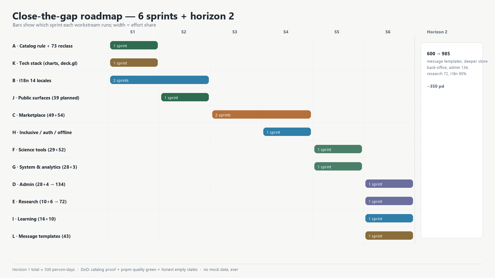

# برنامهٔ اجرایی بستن شکاف فرانت‌اند — هیدروما نوژین (نسخهٔ ۲، هم‌راستا با اسناد مخزن)

**مبنا:** `docs/frontend/FRONTEND_GAP_ANALYSIS.md` + کاتالوگ ۶۰۰ ورودی + اسناد موجود مخزن
**تاریخ:** ۲۰۲۶/۰۹/۲۷ · **افق:** دو افق — «بستن شکاف در سطح قابلیت» و «رسیدن به هدف سند جامع»
**وضعیت شروع:** مسیر فیزیکی ۳۵۰ · کاتالوگ ۶۰۰ · live ۱۳۲ · capability ۵۹ · planned ۲۵۵ · unavailable ۱۵۴

---

## ۰) اصلاح مهم معیار (هم‌راستا با نقشهٔ راه مخزن)

نقشهٔ راه موجود پروژه (`FRONTEND_DEVELOPMENT_ROADMAP_FA_2026-09-26.md`) درست می‌گوید: **«۶۰۰ صفحه» عدد رجیستری است، نه هدف محصول.** ساختن یک صفحه به‌ازای هر ورودی باقی‌مانده، ۲۵۵ فایل و آزمون تکراری می‌سازد. پس معیار تکمیل در این سند این‌هاست:

| معیار | توضیح |
|---|---|
| **قابلیت bind‌شده** | یک صفحهٔ واقعی که چند endpoint را به هم می‌بندد (نه یک صفحه به‌ازای هر مسیر) |
| **جریان سرتاسری کارکننده** | مثل «مرور→سبد→امانت→کلید یکتا→تحویل→تسویه» |
| **اثبات در مخزن** | route file یا قرارداد منتشرشده؛ هیچ صفحه‌ای بدون مدرک، وضعیت بالاتر نمی‌گیرد |

تفکیک چهارگانه‌ای که سنجش را دقیق می‌کند: **مسیر فیزیکی** (فایل) ≠ **مسیر منطقی** (کاتالوگ) ≠ **قابلیت** (endpoint bind‌شده) ≠ **صفحهٔ داده‌دار**.

**آنچه این سند اضافه می‌کند:** توالی زمانی، برآورد نفر-روز به تفکیک ورک‌استریم، برنامهٔ چندزبانگی، شکاف پشتهٔ فناوری، و لایهٔ قالب‌های پیام. آنچه تکرار نمی‌کند: فهرست صفحه‌به‌صفحه (`PAGE_CHECKLIST_600.md`)، دروازه‌ها (`PAGE_GATES.md`)، و درخواست قرارداد (`CONTRACT_REQUEST_154.md`).

---

## ۱) طبقه‌بندی واقعی کار باقی‌مانده (۴۰۹ واحد)

| گروه | تعداد | چرا/چگونه |
|---|---|---|
| **بدون قرارداد** (`unavailable`) | ۱۵۴ | تا انتشار endpoint، صفحه = ساختن داده. مسیر: `CONTRACT_REQUEST_154.md` (۳۶ خوشهٔ API) |
| از این ۱۵۴، **دارای صفحهٔ موجود** | ۷۳ | یا محتوای ثابت‌اند یا منتظر قرارداد؛ نیازمند تفکیک وضعیت |
| از این ۷۳، **محتوای ثابت** (بدون نیاز به endpoint) | ~۲۰ | `/about`، `/statements`، `/services`، `/trust`، `/ai`، `/accessibility`، `/offline`، `/simple`، `/design-system` |
| **نوشتنی/نقش‌محور** (`planned`) | ~۱۱۷ | به session + نقش + `Idempotency-Key` + بازبینی امنیتی گره خورده |
| **خواندنی نیازمند احراز هویت** | ~۷ | `/api/v1/analytics/*` با `require_user` |
| **خواندنی و آزاد** | ~۲۲ | قابل ساخت همین حالا (بخشی ساخته شد) |
| `planned` باقی‌مانده | ۲۵۵ | در **~۳۶ خوشهٔ API** جمع می‌شود → ساخت **~۴۰ صفحهٔ واقعی** |

**نتیجهٔ عملی:** هدف افق ۱ «۴۰ صفحهٔ قابلیت‌محور + ۳۶ خوشهٔ bind‌شده + جریان‌های سرتاسری»، نه «۲۵۵ فایل جدید».

---

## ۲) ورک‌استریم‌ها با برآورد

### A) تفکیک وضعیت کاتالوگ — ۱۵ نفر-روز
| تسک | جزئیات | پذیرش |
|---|---|---|
| A1 افزودن وضعیت `static` | ~۲۰ صفحهٔ محتوایی از `unavailable` به `static` (indexable) | کاهش ۲۰ واحد از unavailable |
| A2 تفکیک داده‌ای از ثابت | ۵۳ باقی‌مانده (bazaars/product/...) با پرچم «منتظر قرارداد» می‌مانند | صفر ابهام وضعیت |
| A3 بازبینی `sourceOfTruth` | هر ۶۰۰ رکورد مدرک معتبر | تست `page-catalog.integrity` سبز |

### B) چندزبانه — ۵۵ نفر-روز
تکمیل ۱۰ فضانام گمشده (`admin, workspace, public, manual, help, layout, owner, why, surface, sponsors`) در ۱۲ زبان · موج ۱ (`de,es,fr,hi,pt,zh`) از ~۳۵٪ به **≥۸۰٪** · موج ۰ (`ar,ur`) از ~۴۰٪ به **≥۹۵٪** · واژه‌نامهٔ کشاورزی/مالی · پروژهٔ Playwright per-locale برای RTL.

### C) بازارگاه — ۹۵ نفر-روز (وابسته به قرارداد)
۳۶ خوشه از `CONTRACT_REQUEST_154.md`: `market/bazaars` ۱۹ · `market/product` ۱۱ · `market/search` ۹ · `market/categories` ۴ · `market/stores` ۴.
| بسته | تسک | برآورد |
|---|---|---|
| C-FE | ساخت صفحات قابلیت‌محور روی خوشه‌ها (هر صفحه چند endpoint) | ۵۵ |
| C-FLOW | جریان‌های سرتاسری: خرید+امانت، داوری، تأسیس بازارچه (۱۰ گام) | ۳۰ |
| C-BE | پیگیری ۴۷ قرارداد منتشرنشدهٔ بازارگاه | ۱۰ |

### F) علمی هیدروما — ۵۵ نفر-روز (مسیر بحرانی)
۵۲ خوشهٔ `hydroma/tools/*/execute` + ۲۹ planned (تحلیل‌ها و کربن).
| بسته | تسک | برآورد |
|---|---|---|
| F-BE | فعال‌سازی endpointهای اجرا (وابسته به هستهٔ C++/موتور) | ۱۵ |
| F-FE | الگوی واحد ابزار (T07): ورودی + خروجی + نسخهٔ مدل + بازهٔ عدم‌قطعیت | ۲۰ |
| F-PL | تحلیل‌ها (topography/runoff/groundwater/irrigation/structure/crop-water) و کربن | ۲۰ |

### D) ادمین — ۴۵ نفر-روز
۲۸ planned (`bots`, `content*`, `errors*`, `models*`, `security/*`, `users`, `settings`) + ۴ unavailable. قالب T08 + نوشتنی‌های نقش‌محور.

### E) پژوهش — ۲۸ نفر-روز
۱۰ planned (`research/hub/runs*`, `science/{citations,datasets,model-cards,zenodo,agrovoc}`) + ۶ unavailable (`experiments/*`).

### G) سامانه و تحلیل — ۳۲ نفر-روز
۲۸ planned (`system/analytics/*`, `automation/*`, `dashboard/public/*`) + ۳ unavailable.

### H) شمول‌سازی/حساب/آفلاین — ۳۰ نفر-روز
۲۸ planned (`auth/2fa`, `api-keys`, `billing`, `preferences`…) + ۹ unavailable (`offline`, `simple`, `inclusive/{sms,ussd,voice}`).

### I) آموزش — ۲۵ نفر-روز
۱۶ planned (`learn/legal/*` نسخه‌دار، `learn/manual/*`) + ۱۰ unavailable (courses/certificates/video).

### J) عمومی — ۳۰ نفر-روز
۳۹ planned (`ai/analysis/*`, `ai/chat`, `ai/stream`, `ai/voice/tts`, `help/*`) + ۱۲ unavailable (که با A1 به `static` می‌رسند).

### L) قالب‌های پیام — ۲۲ نفر-روز
۴۳ قالب ایمیل/پیامک/USSD/اعلان، ۱۴زبانه، با محدودیت کاراکتر در ویرایشگر.

### K) پشتهٔ فناوری — ۱۲ نفر-روز
افزودن کتابخانهٔ نمودار (ECharts) ۳ · `deck.gl` ۳ · خط تولید توکن (Style Dictionary) ۲ · Motion ۲ · (Yjs/Three.js: تصمیم به تأخیر).

---

## ۳) زمان‌بندی (۶ سپرینت دوهفته‌ای، تیم ۳ نفره)

| سپرینت | تمرکز | خروجی سنجش‌پذیر |
|---|---|---|
| S1 | A + K + شروع B | unavailable −۲۰؛ `quality` سبز؛ کتابخانهٔ نمودار وارد |
| S2 | B + J | موج ۰ ≥۹۵٪، موج ۱ ≥۸۰٪؛ عمومی به‌جز موارد وابسته کامل |
| S3 | C (نیمهٔ اول) | خوشه‌های `market/search` و `market/categories` و part of bazaars bind شدند |
| S4 | C-FLOW + H | جریان خرید تا تسویه سرتاسری؛ حساب/آفلاین کامل |
| S5 | F + G | ابزارهای علمی با endpoint زنده و الگوی T07؛ تحلیل‌ها کامل |
| S6 | D + E + I + L | ادمین/پژوهش/آموزش/قالب‌ها؛ شکاف «قابلیت‌محور» بسته |

**افق ۲ (۶ سپرینت بعد):** گسترش به هدف سند جامع (۹۸۵ واحد): عمق پشتیبان فروشنده/مالی/نظارت، ادمین ۱۳۴، پژوهش ۷۲، ترجمهٔ ۹۵٪.

---

## ۴) Definition of Done (هر قابلیت)

۱) صفحه چند endpoint را bind می‌کند (نه یک صفحه به‌ازای هر مسیر).
۲) دادهٔ واقعی؛ حالت‌های `loading/empty/error/partial/offline` پوشش دارد؛ **هیچ دادهٔ ساختگی**.
۳) همهٔ رشته‌ها در `fa`/`en` و کلید در ۱۲ زبان دیگر.
۴) RTL/LTR بررسی‌شده؛ `num` برای اعداد؛ کنتراست ≥۴٫۵:۱.
۵) تست Vitest + Playwright؛ `pnpm quality` سبز؛ وضعیت کاتالوگ ارتقا یافته.
۶) برای نوشتنی‌ها: `Idempotency-Key`، نقش، و بازبینی امنیتی.

---

## ۵) KPI

| KPI | هدف |
|---|---|
| قابلیت bind‌شدهٔ جدید | ≥۳ در هفته |
| جریان سرتاسری کارکننده | ≥۱ در هر سپرینت |
| پوشش ترجمهٔ موج ۰/۱ | +۳٪ هفتگی |
| `pnpm quality` | ۱۰۰٪ سبز |
| رگرسیون a11y / عملکرد | صفر نقض بحرانی؛ حفظ بودجه |

---

## ۶) ریسک‌ها و کاهش

| ریسک | کاهش |
|---|---|
| قراردادهای منتشرنشده (۴۷ بازارگاه + ۵۲ علمی) | پیشبرد `CONTRACT_REQUEST_154.md`؛ جایگزین **ممنوع** (بدون mock) |
| هستهٔ C++ ساخته نشده | اولویت build در `engine/cpp_core`؛ تا آن زمان نمایش صادقانهٔ وضعیت |
| ترجمهٔ انسانی کند | MT + بازبینی واژه‌نامه؛ بلاک CI روی آستانهٔ موج ۰/۱ |
| تکرار موازی‌کاری روی یک شاخه | قفل حوزه‌ای هر ورک‌استریم |

---

## ۷) جمع برآورد افق ۱

| ورک‌استریم | نفر-روز |
|---|---|
| C بازارگاه | ۹۵ |
| B چندزبانه | ۵۵ |
| F علمی | ۵۵ |
| D ادمین | ۴۵ |
| G سامانه/تحلیل | ۳۲ |
| H شمول/حساب | ۳۰ |
| J عمومی | ۳۰ |
| E پژوهش | ۲۸ |
| I آموزش | ۲۵ |
| L قالب‌های پیام | ۲۲ |
| A کاتالوگ | ۱۵ |
| K پشتهٔ فناوری | ۱۲ |
| **جمع** | **≈ ۴۴۴ نفر-روز** |

با تیم ۳ نفره و بهره‌وری ۰٫۸ → افق ۱ حدود **۵–۶ ماه**؛ افق ۲ حدود **۴ ماه** دیگر.

---

## ۸) نخستین گام‌های همین هفته

1. **A1**: افزودن وضعیت `static` و ارتقای ~۲۰ صفحهٔ محتوایی (سریع‌ترین برد، اثر سئو).
2. **B1**: ساخت اسکلت ۱۰ فضانام گمشده در ۱۲ زبان تا `check-locale-depth` خطای ساختاری ندهد.
3. **C-BE/F-BE**: پیگیری `CONTRACT_REQUEST_154.md` (۳۶ خوشه) — مسیر بحرانی.
4. **F-OPS**: تصمیم build هستهٔ C++ (`engine/cpp_core`).

---

## پیوست — هم‌راستایی با اسناد موجود (پرهیز از تکرار)

| سند موجود | پوشش | رابطه با این سند |
|---|---|---|
| `FRONTEND_DEVELOPMENT_ROADMAP_FA_2026-09-26.md` | معیار قابلیت‌محور، تحلیل ۲۵۵/۱۵۴ | مبنای معیار این سند |
| `FRONTEND_COMPLETION_PLAN_FA_2026-09-26.md` | «۲۲۱ مسیر قابل ساخت نیست» + ۲۲ صفحهٔ ساخته‌شده | پیشینهٔ اجرا |
| `CONTRACT_REQUEST_154.md` | ۳۶ خوشهٔ API بدون قرارداد | ورودی C-BE/F-BE |
| `PAGE_CHECKLIST_600.md` | سنجهٔ صفحه‌به‌صفحه | مرجع اجرا، تکرار نشده |
| `PAGE_GATES.md` | قرارداد دروازه‌ها (MKT-G*) | تعریف پذیرش C-FLOW |
| `MARKETPLACE_IMPLEMENTATION.md` / `PUBLIC_PAGES_EXECUTION.md` | جزئیات دو سطح | جزئیات، تکرار نشده |
| `FRONTEND_GAP_ANALYSIS.md` | اعداد شکاف (این نشست) | ورودی این سند |
