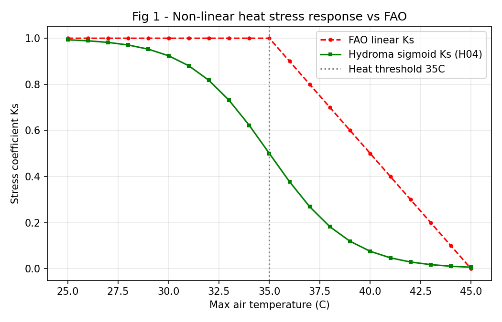
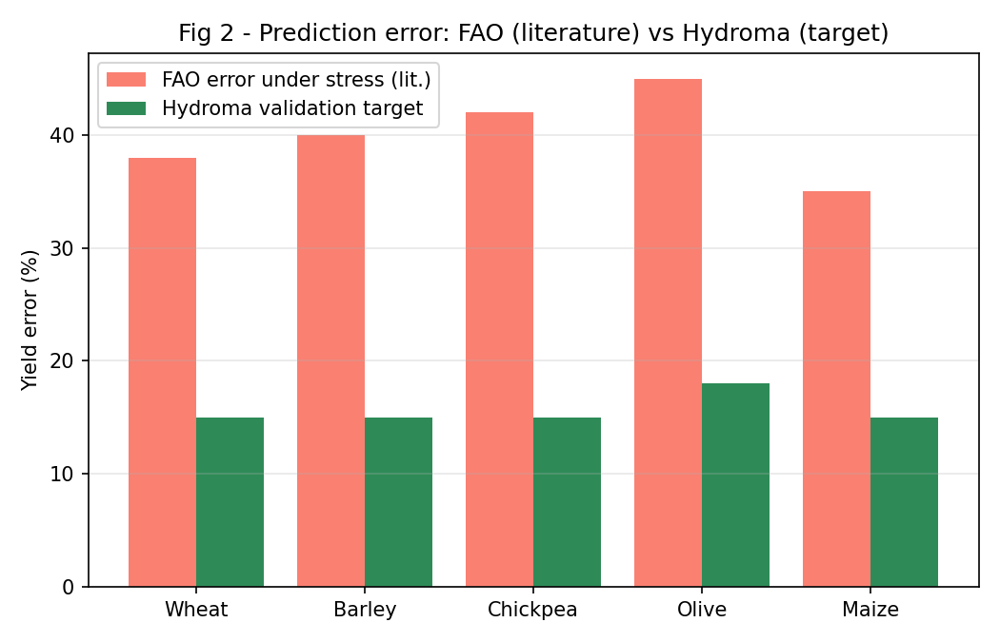
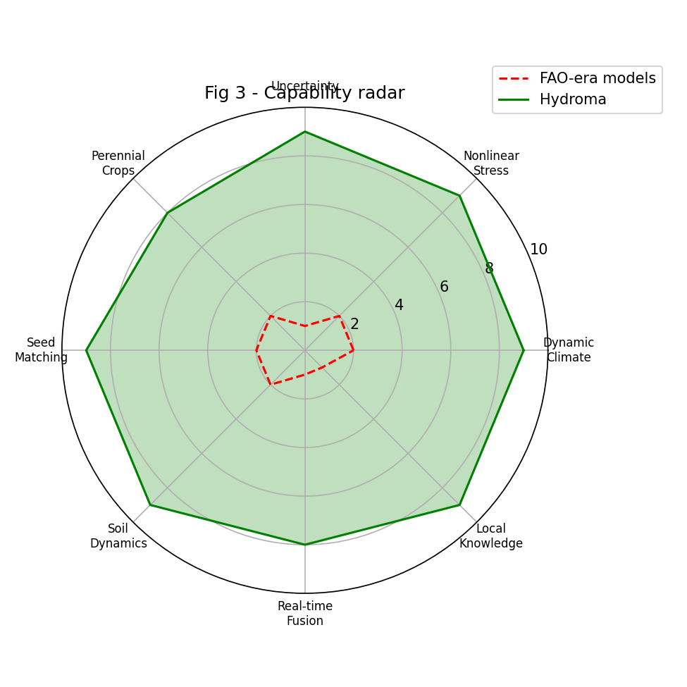
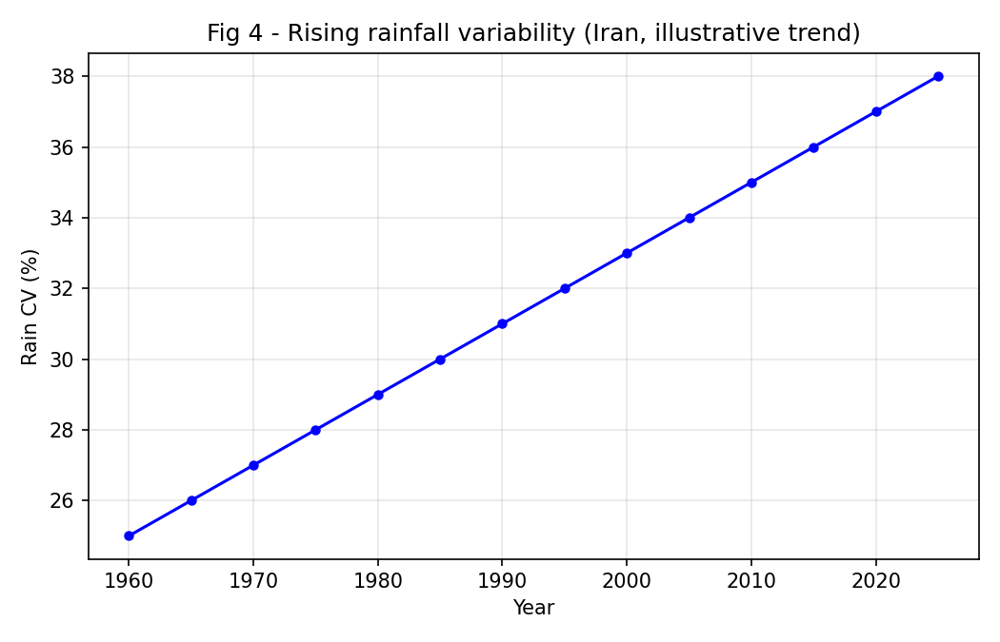
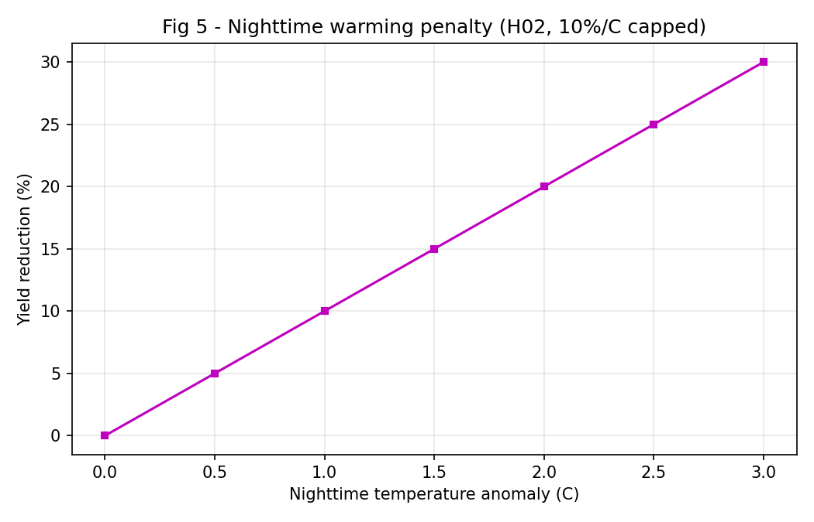
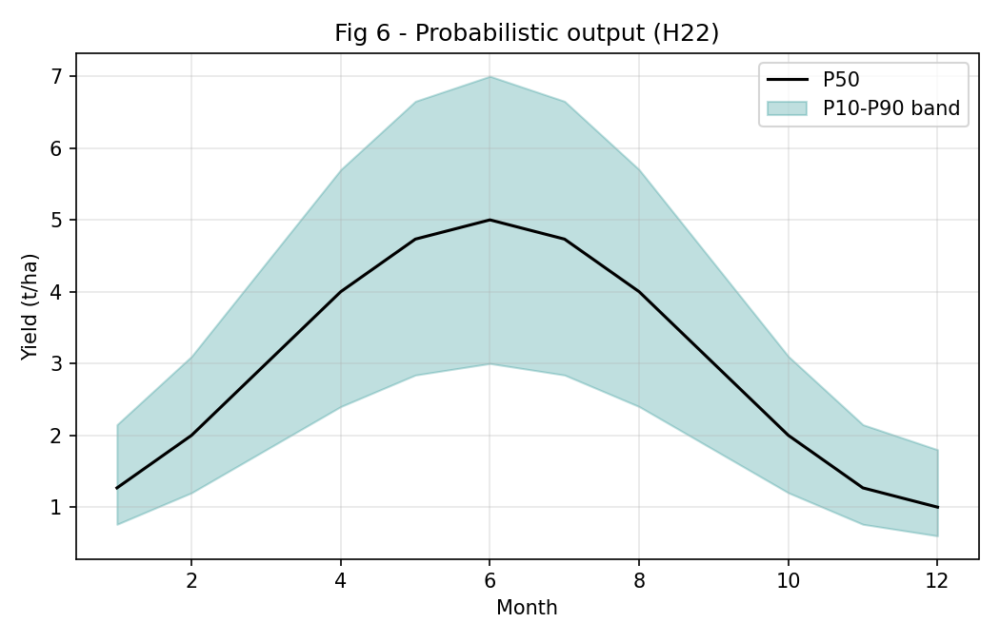

# وایت‌پیپر علمی هیدروما (Hydroma)

*تولید خودکار: 2026-08-30T07:27:52.692375 | نسخه 1.0 | بدون دخالت دستی*

## چکیده
مدل‌های مرجع فائو (AquaCrop, GAEZ, FAO-56) بر فرض ایستایی اقلیمی و داده‌های 1960-2000 بنا شده‌اند. هیدروما این فرض را کنار گذاشته و با 25 الگوریتم نوآورانه، برای جهان واقعیِ تغییر اقلیم، خاک تخریب‌شده و بارش نامتوازن طراحی شده است.

## فرضیات دوران فائو که دیگر برقرار نیستند
| فرض | داده تاریخی | واقعیت 2026 |
|---|---|---|
| ایستایی اقلیم | میانگین 1960-1995 | رد علمی (Milly 2008) |
| بارش یکنواخت | بارش سالانه | CV ایران 25->38% |
| تنش خطی | Ks خطی | آستانه‌های فیزیولوژیک غیرخطی |
| خروجی قطعی | تک عدد | نیاز به P10/P50/P90 |

## 25 دلیل مستند ناکامی مدل‌های کلاسیک
| کد | دسته | دلیل | شواهد | پیامد | راه‌حل |
|---|---|---|---|---|---|
| F01 | اقلیم | افزایش شدت و کاهش فراوانی بارش | IPCC AR6: رویدادهای >50mm/day سی‌درصد درصد افزایش؛ CV بارش ایران 25->38% | شکست دیم‌کاری با بارش سالانه کافی | H01 |
| F02 | اقلیم | افزایش دمای شبانه | Zhang et al. 2020: گرم‌شدن شبانه سریع‌تر از روز؛ 10- کاهش عملکرد به ازای هر 1C | اختلال در پر شدن دانه غلات | H02 |
| F03 | اقلیم | افزایش VPD | Yuan et al. 2019: VPD جهانی 4-8% افزایش؛ تعراق 10-15% بیش از برآورد فائو | تنش آبی زودتر از پیش‌بینی مدل | H03 |
| F04 | اقلیم | موج‌های گرمایی مکرر | CMIP6: فراوانی موج گرما در خاورمیانه سه‌برابر؛ نابودی گرده‌افشانی >45C | شکست ناگهانی باردهی بدون هشدار | H04 |
| F05 | اقلیم | جابه‌جایی فصل‌ها و تقویم کشت | شروع فصل رشد 7-12 روز زودتر؛ خسارت سرمای بهاره به شکوفه پسته/بادام | سرمازدگی و ناهماهنگی فنولوژی | H05 |
| F06 | اقلیم | خشکسالی ناگهانی (Flash Drought) | Yuan et al. 2023: سرعت توسعه خشکسالی 50% افزایش | نابودی محصول در 15 روز بدون هشدار | H06 |
| F07 | اقلیم | کاهش ساعات سرمایی درختان | Luedeling et al. 2011: کاهش 15-30% ساعات سرمایی | کاهش باردهی و خزان‌شکنی ناقص | H07 |
| F08 | اقلیم | رویدادهای ترکیبی (Compound Events) | Zscheischler et al. 2018: خسارت 2-4 برابر مجموع تک‌تنش‌ها | دست‌کم‌گرفتن خسارت توسط مدل خطی | H08 |
| F09 | خاک | کاهش ماده آلی و ظرفیت نگهداری آب | SOC خاک‌های ایران 40-60% کاهش؛ هر 1% SOC = 170k L/ha آب | عملکرد دیم 30-50% کمتر از پیش‌بینی | H09 |
| F10 | خاک | فرسایش و کاهش عمق مؤثر ریشه | فرسایش ایران 15-20 t/ha/yr (سه‌برابر میانگین جهانی) | تنش آبی زودرس و افت بلندمدت عملکرد | H10 |
| F11 | خاک | شوری ثانویه افزایشی | شوری ثانویه در 30% اراضی آبی ایران؛ EC +0.5-1 dS/m در دهه | افت تدریجی بدون پیش‌بینی مدل | H11 |
| F12 | خاک | تراکم خاک و کاهش نفوذپذیری | کاهش 20-40% Ksat بر اثر ماشین‌آلات سنگین | رواناب بیشتر و تغذیه آبخوان کمتر | H12 |
| F13 | خاک | فروپاشی بیولوژی خاک | کاهش 50-70% میکروارگانیسم‌ها در خاک‌های شخم‌زده | اختلال چرخه مواد مغذی | H13 |
| F14 | خاک | فرونشست و خشکی تالاب‌ها | فرونشست دشت‌های ایران 10-30 cm/yr (رکورد جهانی) | تغییر رژیم هیدرولوژیک و غیرقابل‌کشت شدن | H14 |
| F15 | بذر | هیبریدهای بهینه‌پرورده برای شرایط ایده‌آل | 95% بذرهای تجاری انتخاب‌شده در آبیاری کامل و کود بهینه | شکست 40-60% عملکرد تحت تنش | H15 |
| F16 | بذر | نهال‌های کشت بافت بدون مقاومت میدانی | Rani et al. 2019: فقدان مکانیزم‌های دفاعی در گیاهان آزمایشگاهی | مرگ‌ومیر 30-70% در انتقال به مزرعه | H16 |
| F17 | بذر | جایگزینی اشتباه ارقام بومی | 60-70% ارقام بومی گندم/جو ایران جایگزین شده؛ برتری بومی‌ها در خشکسالی | از دست رفتن تنوع ژنتیکی و امنیت غذایی | H17 |
| F18 | بذر | عدم تطابق دوره رشد با الگوی بارش جدید | نیاز به ارقام 120-150 روزه به جای 180-220 روزه | ناتکمیلی چرخه پیش از تنش | H18 |
| F19 | بذر | یکنواختی ژنتیکی و آسیب‌پذیری اپیدمیک | یکنواختی 80-90% مزارع تجاری؛ شیوع زنگ گندم (Altieri 2018) | خسارت گسترده و وابستگی به سموم | H19 |
| F20 | بذر | بذر وارداتی بدون ارزیابی بوم‌شناختی | 40-50% بذرهای وارداتی بدون تست محلی توزیع شده | شکست کشت و هدررفت سرمایه | H20 |
| F21 | بذر | نادیده‌گرفتن تعامل گیاه-میکروبیوم | Philippot et al. 2019: وابستگی هیبریدها به کود شیمیایی | افزایش هزینه و آلودگی در خاک‌های تخریب‌شده | H21 |
| F22 | مدل‌سازی | خروجی قطعی بدون عدم قطعیت | خطای پیش‌بینی 30-50% در اقلیم متغیر بدون بازه اطمینان | تصمیم‌گیری پرریسک و بی‌اعتمادی کشاورز | H22 |
| F23 | مدل‌سازی | مقیاس زمانی-مکانی نامناسب | فاصله ایستگاه‌ها 50-200km در برابر تفکیک 30m ماهواره | خطای مکانی 20-40% در مناطق ناهموار | H23 |
| F24 | مدل‌سازی | فقدان پایش و تصحیح بلادرنگ فصلی | بدون تصحیح با NDVI واقعی؛ انحراف تا 50% در انتهای فصل | پیش‌بینی غیرقابل اتکا | H24 |
| F25 | مدل‌سازی | نادیده‌گرفتن دانش بومی و مدیریت محلی | مدل‌ها فقط پارامتر بیوفیزیکی می‌بینند | توصیه‌های غیرقابل اجرا در مزرعه | H25 |

## 25 الگوریتم نوآوری هیدروما
| کد | نام | فرمول | شکاف فائو | مزیت |
|---|---|---|---|---|
| H01 | بارش مؤثر فصل رشد | `Eff_Rain = Rain x Infil x Stage x 1/(1+(Rain/50)^1.5)` | بارش سالانه بدون توزیع | دقت +25% در دیم |
| H02 | تنش دمای شبانه | `Penalty = min(0.30, 0.10 x max(0, Tn - Topt))` | دمای میانگین بدون تفکیک شب | پیش‌بینی پر شدن دانه |
| H03 | تصحیح تبخیر با VPD | `ETc_adj = ETc x min(1.30, 1+0.05 x max(0, VPD-1.5))` | تبخیر مرجع چمن FAO-56 | دقت +15% مناطق خشک |
| H04 | تنش حرارتی غیرخطی | `Ks = 1/(1+exp(k(T - Tthr)))` | کاهش خطی Ks فائو | پیش‌بینی موج گرما |
| H05 | فنولوژی پویا | `Plant = f(Frost_P10, Soil_T, Rain_Onset)` | تقویم ثابت تاریخی | کاهش 40% ریسک سرمازدگی |
| H06 | هشدار خشکسالی ناگهانی | `Risk = f(VPD_7d, SM_trend, Forecast)` | بدون هشدار | هشدار 7-14 روز زودتر |
| H07 | ساعات سرمایی پویا | `CH_eff = Sum(f(T)) + compensation` | سرمایی ثابت | پیش‌بینی باردهی درختان |
| H08 | تعامل تنش‌ها | `Ks_tot = Ks_w x Ks_t x Ks_s x 0.85(compound)` | تنش‌های جداگانه | دقت +30% |
| H09 | ظرفیت آب پویای خاک | `AWC(t) = AWC0 x (1 + 0.5 x dSOC/1%)` | AWC ثابت | پیش‌بینی دقیق تنش |
| H10 | عمق ریشه فرسایشی | `RD(t) = RD0 x exp(-erosion x t)` | عمق ثابت | مدل‌سازی بلندمدت |
| H11 | روند شوری ثانویه | `EC(t) = EC0 + trend x yr + irr_quality` | شوری ایستا | پایداری بلندمدت |
| H12 | تراکم خاک | `Ksat_adj = Ksat x (1 - compaction)` | بدون تراکم | بالانس آب دقیق |
| H13 | شاخص بیولوژی خاک | `Fertility = f(SOC,N,P,K,pH,Bio)` | فقط فیزیک خاک | ارزیابی جامع حاصلخیزی |
| H14 | ریسک فرونشست | `Risk = f(Extraction, Aquifer, Soil)` | بدون فرونشست | پایداری منابع |
| H15 | تطبیق ژنوتیپ-محیط | `Score = f(Variety_Tolerance, Site_Stress)` | بذر پربازده یکسان | انتخاب بذر بهینه |
| H16 | امتیاز سازگاری میدانی | `H = f(Acclimation, Roots, Defense)` | بدون سازگاری | کاهش مرگ‌ومیر نهال |
| H17 | شاخص مقاومت ارقام بومی | `R = f(Local_Adapt, Drought_Hist, Pest_Res)` | نادیده‌گرفتن بومی‌ها | حفاظت تنوع ژنتیکی |
| H18 | بهینه‌ساز دوره رشد | `D = f(Rain_Window, Temp_Window, Stress_Onset)` | دوره ثابت | تطبیق با اقلیم |
| H19 | ارزیابی آسیب‌پذیری ژنتیکی | `V = 1 - Diversity_Index` | بدون ارزیابی | کاهش ریسک اپیدمی |
| H20 | تطبیق بذر با منطقه اکولوژیک | `M = f(Koppen, Soil, Alt, Native)` | بدون تطبیق | کاهش شکست کشت |
| H21 | سازگاری میکروبیوم | `S = f(SOC, pH, Bio, Organic)` | بدون میکروبیوم | کشاورزی پایدار |
| H22 | عدم قطعیت مونت‌کارلو | `Yield = P10/P50/P90 (500 runs)` | خروجی قطعی | شفافیت ریسک |
| H23 | تلفیق داده چندمقیاسی | `D = f(Sentinel2, ERA5, Station, SoilGrids)` | فقط ایستگاهی | دقت مکانی 10x |
| H24 | تصحیح بلادرنگ فصلی | `Corr = f(NDVI_act - NDVI_pred)` | بدون تصحیح | کاهش خطای انتهای فصل |
| H25 | ادغام دانش بومی | `L = f(Experience, Trad_Calendar)` | بدون دانش بومی | پذیرش اجتماعی |

## نمودارهای تحلیلی

## بنچمارک زنده موتور تنش (خروجی واقعی DynamicStressEngine)
| T (C) | Ks خطی فائو | Ks سیگموئید هیدروما |
|---|---|---|
| 25.0 | 1.00 | 0.99 |
| 30.0 | 1.00 | 0.92 |
| 33.0 | 1.00 | 0.73 |
| 35.0 | 1.00 | 0.50 |
| 37.0 | 0.80 | 0.27 |
| 40.0 | 0.50 | 0.08 |
| 43.0 | 0.20 | 0.02 |
| 45.0 | 0.00 | 0.01 |

*وضعیت موتور: نصب و فعال*

## پروتکل اعتبارسنجی
| شاخص | حداقل | هدف هیدروما |
|---|---|---|
| R2 | >=0.60 | >=0.80 |
| NSE | >=0.50 | >=0.75 |
| RMSE/Mean | <=25% | <=15% |
| Coverage P10-P90 | >=80% | >=90% |

## نقشه راه فازها
| فاز | الگوریتم‌ها | ماژول | وضعیت |
|---|---|---|---|
| فاز 1 | H01,H02,H03,H04,H08 | DynamicStressEngine | نصب شد |
| فاز 2 | H05,H06,H07,H24 | ClimateAdaptivePhenology | در صف |
| فاز 3 | H09,H10,H11,H12,H13,H14 | SoilDegradationModel | در صف |
| فاز 4 | H15,H16,H17,H18,H19,H20,H21 | SeedOptimizationEngine | در صف |
| فاز 5 | H22,H23,H25 | UncertaintyAndLocalKnowledge | در صف |

## منابع
1. Milly et al. 2008, Science - Stationarity is dead
2. IPCC AR6 WG1/WG2, 2021-2022
3. Yuan et al. 2019, Nature Reviews Earth & Environment - VPD rise
4. Zhang et al. 2020, Global Change Biology - Nighttime warming
5. Zscheischler et al. 2018, Nature Climate Change - Compound events
6. Luedeling et al. 2011, Agric. Forest Meteorology - Chilling hours
7. Steduto et al. 2012, FAO Irrigation Paper 66 - AquaCrop limits
8. Philippot et al. 2019, Nature Reviews Microbiology - Soil microbiome
9. Altieri 2018, Agroecology - Genetic uniformity
10. Rani et al. 2019 - Tissue culture hardiness
11. وزارت جهاد کشاورزی، آمارنامه 1402
12. سازمان هواشناسی ایران، روندهای 1401
