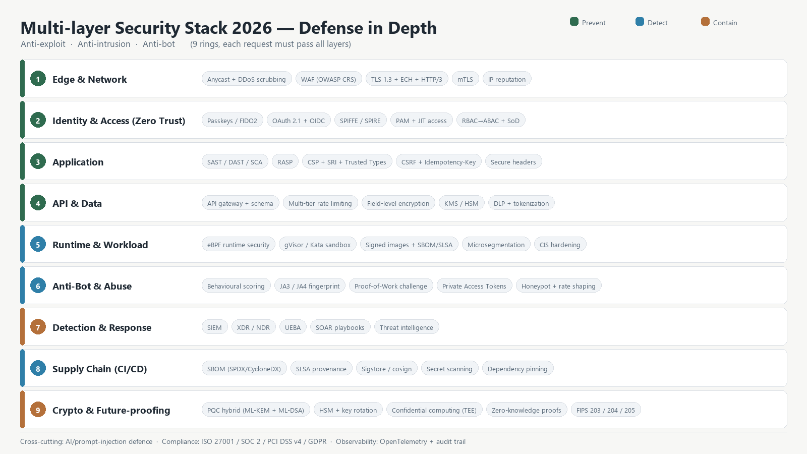

# پشتهٔ امنیتی چندلایه ۲۰۲۶ — دفاع در عمق، ضدهک، ضدنفوذ و ضدربات

**دامنه:** فناوری‌های روز امنیت برای یک پلتفرم وب/API چندمستاجری با دادهٔ مالی و علمی
**تاریخ:** ۲۰۲۶/۰۹/۲۶ · **وضعیت:** سند مرجع (Research + Gap Analysis)
**یادداشت صداقت منابع:** جست‌وجوی وب زنده در این نوبت نتایج بی‌ربط/ناقص برگرداند؛ بنابراین در این سند **هیچ ارجاع URL داستان‌سرهمی درج نشده** و محتوا بر پایهٔ استانداردها و فناوری‌های شناخته‌شده و مستند است (نام استانداردها دقیق آورده شده تا قابل راستی‌آزمایی باشد).

---

## بخش ۰ — اصل حاکم: دفاع در عمق (Defense in Depth)

هیچ لایه‌ای تنها کافی نیست. مدل ۲۰۲۶ «چاه‌مرگ» نیست، بلکه **۹ حلقهٔ متوالی** است که مهاجم برای رسیدن به داده باید از همه بگذرد؛ شکست هر حلقه فقط «هزینهٔ مهاجم» را بالا می‌برد و «زمان تشخیص» را کم می‌کند. سه معیار هر لایه:

| معیار | پرسش |
|---|---|
| جلوگیری (Prevent) | چه چیزی را اصلاً ممکن نمی‌کند؟ |
| کشف (Detect) | چه چیزی را در چند ثانیه می‌بیند؟ |
| مهار (Contain) | وقتی رد شد، چقدر زود محدودش می‌کند؟ |

---

## بخش ۱ — نُه حلقهٔ پشتهٔ امنیتی ۲۰۲۶

### حلقهٔ ۱ — لبه و شبکه (Edge & Network)

| فناوری | نقش | استاندارد/مرجع |
|---|---|---|
| هرپخش (Anycast) + Scrubbing Center | جذب و پاک‌سازی DDoS حجمی/پروتکلی | BGP Anycast |
| WAF نسل‌جدید (امتیازدهی معنایی، نه فقط regex) | SQLi/XSS/RCE/Path traversal | OWASP CRS، OWASP Top 10 |
| TLS 1.3 + ECH + HTTP/3 (QUIC) | رمزنگاری ترافیک، پنهان‌سازی SNI، مقاومت به downgrade | RFC 8446 / RFC 9000 |
| mTLS و IP-reputation | احراز دوسویه در سرویس‌به‌سرویس | X.509، OCSP stapling |
| Bot-gateway در لبه | تفکیک انسان/ربات پیش از ورود به اپ | JA4/TLS fingerprint |

### حلقهٔ ۲ — هویت و دسترسی (Zero Trust)

| فناوری | نقش |
|---|---|
| **Passkeys / FIDO2-WebAuthn** | حذف رمز عبور؛ مقاوم به فیشینگ و replay |
| OAuth 2.1 + OIDC، PKCE | ورود فدرال امن |
| **SPIFFE/SPIRE** + workload identity | هویت رمزنگاری‌شدهٔ هر بارِ کاری/سرویس |
| PAM و JIT access | دسترسی موقت و ثبت‌شده به سیستم‌های حساس |
| RBAC→ABAC + SoD | تفکیک وظایف، حداقل دسترسی |
| Step-up authentication | احراز پله‌ای برای کنش‌های مالی |

«هرگز اعتماد نکن، همیشه تأیید کن» — هیچ درخواست درون‌شبکه‌ای به‌طور پیش‌فرض معتبر نیست.

### حلقهٔ ۳ — کاربرد (Application)

| فناوری | نقش |
|---|---|
| SAST + DAST + IAST + SCA در CI | کشف آسیب‌پذیری پیش از انتشار |
| **RASP** (Runtime Application Self-Protection) | تشخیص نفوذ در زمان اجرا داخل اپ |
| CSP سخت‌گیرانه + SRI + Trusted Types | خنثی‌سازی XSS و تزریق اسکریپت |
| CSRF token + SameSite + Idempotency-Key | جلوگیری از کنش تکرارشونده/جعل درخواست |
| Security headers (HSTS, X-CTO, Referrer-Policy, Permissions-Policy) | سخت‌سازی مرورگر |

### حلقهٔ ۴ — API و داده

| فناوری | نقش |
|---|---|
| API Gateway + schema validation (OpenAPI) | رد درخواست‌های بی‌ساختار |
| محدودسازی نرخ چندسطحی (IP/کاربر/توکن/Endpoint) | ضد brute-force و scraping |
| Scope دقیق OAuth + mTLS بین سرویس‌ها | حداقل دسترسی ماشین‌به‌ماشین |
| رمزنگاری در حال سکون/انتقال + Tokenization | کاهش ارزش دادهٔ سرقت‌شده |
| KMS/HSM + چرخش کلید | مدیریت کلید سخت‌افزاری |
| DLP + برچسب طبقه‌بندی | جلوگیری از نشت داده |

### حلقهٔ ۵ — بارِ کاری و زمان اجرا (Runtime & Workload)

| فناوری | نقش |
|---|---|
| **eBPF runtime security** | دیدن syscall/شبکه در هسته؛ کشف نفوذ بدون عامل کاربری |
| Sandbox کانتینر (gVisor/Kata) | جداسازی سختِ بارهای نامعتمد |
| Image signing + SBOM + SLSA | فقط تصویر امضاشده اجرا شود |
| Microsegmentation + شبکهٔ خدمت (mTLS) | مهار حرکت جانبی (Lateral movement) |
| CIS Benchmarks + Immutable infra | سخت‌سازی سیستم‌عامل |

### حلقهٔ ۶ — دفاع ضدربات و ضدسوءاستفاده (Anti-Bot & Abuse)

> بخشی که مستقیماً پرسیده شد: تفکیک انسان از ربات و مقابله با اسکرپینگ، credential stuffing و سوءاستفادهٔ اقتصادی.

| فناوری | نوع | نکته |
|---|---|---|
| **امتیازدهی رفتاری** (حرکت موس، ریتم تایپ، مسیر ناوبری) | مبتنی بر رفتار | سیگنال قوی، نیازمند حریم خصوصی محتاطانه |
| **اثر انگشت TLS/JA3/JA4 + HTTP2** | مبتنی بر شبکه | ربات‌ها اغلب کتابخانهٔ یکسان دارند |
| **Challenge اثبات‌کار (Proof-of-Work)** | هزینه‌افزا | جایگزین غیرمزاحم CAPTCHA (مثل Turnstile-like) |
| **Private Access Tokens / WebAuthn attestation** | اعتماد دستگاه | تأیید «دستگاه واقعی» بدون آزمون تصویری |
| **Honeypot / Deception** | فریب | مسیرهای طعمه؛ هر بازدید = مهاجم |
| **Rate shaping + Token bucket** | اقتصادی | گران‌کردن اسکرپینگ |
| **ML scoring + fingerprint rotation** | تطبیقی | انطباق با الگوهای نو |
| Proof-of-personhood (در حال بلوغ) | هویت انسانی | برای کنش‌های حساس (ثبت‌نام انبوه، فروش) |

**اصل طراحی ضدربات:** هرگز به یک سیگنال تکیه نکن؛ امتیاز ترکیبی بساز و بر اساس ریسک، پاسخ را پله‌ای کن (بی‌صدا → تأخیر → چالش → بلاک).

### حلقهٔ ۷ — کشف و پاسخ (Detection & Response)

| فناوری | نقش |
|---|---|
| SIEM + **XDR/NDR** + UEBA | همبستگی و کشف رفتار ناهنجار |
| SOAR + Playbook | پاسخ خودکار (ایزوله‌کردن، مسدودسازی، بازگردانی) |
| Threat Intelligence feeds | تطبیق IOC |
| Purple teaming + BAS | آزمون پیوستهٔ کنترل‌ها |
| SOC ۲۴/۷ یا MSSP | پایش انسانی |

### حلقهٔ ۸ — زنجیرهٔ تأمین نرم‌افزار (Supply Chain)

| فناوری | نقش |
|---|---|
| **SBOM** (SPDX/CycloneDX) | فهرست دقیق اجزا |
| **SLSA** provenance + Sigstore/cosign | اثبات ساخت و امضا |
| Dependency pinning + قفل نسخه | ضد dependency confusion |
| Secret scanning + signed commits | جلوگیری از نشت کلید در کد |
| Renovate/Dependabot + بازبینی CVE | وصله‌پذیری مدیریت‌شده |

### حلقهٔ ۹ — رمزنگاری و آینده‌نگری (Crypto & Future-proofing)

| فناوری | نقش |
|---|---|
| **رمزنگاری پساکوانتومی ترکیبی**: ML-KEM (FIPS 203) + X25519 و ML-DSA (FIPS 204) + Ed25519 | مقاومت در برابر «اکنون ضبط کن، بعداً رمزگشا کن» |
| HSM + چرخش کلید + KMS چندناحیه‌ای | ریشهٔ اعتماد سخت‌افزاری |
| **Confidential Computing (TEE)** | اجرای محرمانهٔ بار کاری حساس |
| Zero-Knowledge Proofs | اثبات بدون افشا (مناسب اثبات کربن/مالی) |

---

## بخش ۲ — دسته‌بندی سه‌گانه‌ای که پرسیدید

| دسته | هدف | فناوری‌های کلیدی |
|---|---|---|
| **ضدهک (Anti-Exploit)** | نگذاریم نفوذ *موفق* شود | WAF، CSP/SRI، RASP، سخت‌سازی، وصله‌پذیری، sandbox، میکروسگمنتیشن |
| **ضدنفوذ (Anti-Intrusion)** | اگر نفوذ شد، *زود بفهمیم و مهار کنیم* | eBPF runtime، XDR/NDR، UEBA، SIEM/SOAR، honeypot، تریس توزیع‌شده |
| **ضدربات (Anti-Bot)** | از سوءاستفادهٔ *خودکار* جلوگیری کنیم | امتیازدهی رفتاری، JA4، Proof-of-Work، Private Access Tokens، rate shaping، deception |

---

## بخش ۳ — هوش مصنوعی: هم سلاح، هم هدف

| محور | کنترل ۲۰۲۶ |
|---|---|
| امنیت مدل/دادهٔ آموزشی | رمزنگاری، دسترسی حداقلی، ثبت منشأ |
| امنیت ورودی مدل (AI apps) | مقاوم‌سازی به **Prompt Injection** و Indirect Injection |
| امنیت خروجی/کنش عامل | محدودسازی ابزارها، تأیید انسانی برای کنش‌های حساس |
| سوءاستفادهٔ ربات‌های مبتنی بر LLM | تشخیص ناهنجاری رفتاری + هزینه‌افزایی + محدودیت نرخ |
| انطباق | ثبت تصمیم‌های خودکار، توضیح‌پذیری |

---

## بخش ۴ — نقشهٔ وضعیت فعلی پروژه (eco_nojin) و شکاف‌ها

پروژه از قبل یک «فایروال چندلایه» در `services/security/` دارد. ارزیابی صادقانه:

| حلقه | وضعیت پروژه | فایل/شاهد | شکاف |
|---|---|---|---|
| WAF | ✅ پیاده‌شده (امتیازدهی + آستانهٔ بلاک) | `waf.py` | قواعد مبتنی بر regex؛ نیاز به CRS رسمی و موتور معنایی |
| Rate limiting | ✅ چندسطحی (IP/کاربر/auth) | `rate_limit.py`, `redis_rate_limit.py` | نبود سهمیهٔ per-token/per-endpoint |
| Honeypot | ✅ مسیرهای طعمه + بلاک ۱۵دقیقه‌ای | `honeypot.py` | طعمه‌ها محدود؛ نیاز به decoy-data |
| Anomaly scoring | ✅ آنتروپی/حجم/نسبت 4xx | `anomaly.py` | نیاز به مدل رفتاری و UEBA |
| Slowloris | ✅ | `slowloris.py` | — |
| Circuit breaker | ✅ | `watchdog.py` | — |
| Post-Quantum | ✅ ترکیبی Kyber/Dilithium (با fallback صادقانه) | `pqcrypto.py` | ارتقا به استانداردهای نهایی FIPS 203/204 (ML-KEM/ML-DSA) |
| Anti-phishing | ✅ دامنهٔ مشابه + SPF/DKIM/DMARC + کلون | `anti_phishing.py` | نیاز به پایش پیوستهٔ برند |
| CSRF/SSRF/Headers | ✅ | `csrf.py`, `ssrf.py`, `headers.py` | — |
| Auth چندمرحله‌ای | جزئی (2FA در auth) | `auth.py` | **Passkeys/FIDO2** و step-up مالی ندارد |
| mTLS سرویس‌به‌سرویس | ❌ | — | افزودن SPIFFE/SPIRE |
| eBPF runtime | ❌ | — | افزودن برای بارهای تولیدی |
| SIEM/SOAR/XDR | ❌ | — | مسیر تولید: Wazuh/OpenSearch + SOAR |
| SBOM/SLSA + امضا | جزئی (Dependabot/pre-commit/secret scan) | `.pre-commit-config.yaml`, CI | افزودن SBOM و image sign |
| ضدربات اختصاصی | ❌ | — | افزودن لایهٔ ۶ (بالاتر) |
| DDoS لبه | ❌ | — | CDN/Anycast |
| WAF ابری/بومی | بومی | `services/security/waf.py` | — |

**نتیجه:** پایهٔ امنیتی پروژه نسبت به میانگین پروژه‌های هم‌رده **قوی** است (۹ لایهٔ داخلی). شکاف‌های اصلی: **ضدربات اختصاصی**، **هویت بدون رمز (Passkeys)**، **mTLS بین سرویس‌ها**، **کشف/پاسخ (SIEM/SOAR)**، **زنجیرهٔ تأمین (SBOM/SLSA)**، و **لبه (DDoS/WAF ابری)**.

---

## بخش ۵ — نقشهٔ راه پیشنهادی (اولویت‌دار)

| اولویت | اقدام | چرا |
|---|---|---|
| P0 | Passkeys/WebAuthn + step-up برای کنش مالی | حذف بزرگ‌ترین سطح حمله (رمز عبور) |
| P0 | لایهٔ ضدربات (JA4 + امتیاز رفتاری + PoW) روی ثبت‌نام/ورود/جست‌وجو | جلوگیری از credential stuffing و اسکرپینگ |
| P1 | mTLS + SPIFFE بین سرویس‌ها | مهار حرکت جانبی |
| P1 | SBOM + امضای تصویر (Sigstore) + SLSA در CI | زنجیرهٔ تأمین |
| P2 | SIEM/UEBA + SOAR Playbook | کشف و پاسخ |
| P2 | لبه: CDN/Anycast + WAF ابری + DDoS scrubbing | مقاومت در برابر حمله حجمی |
| P3 | ارتقای PQC به ML-KEM/ML-DSA (FIPS 203/204) | آینده‌نگری |
| P3 | eBPF runtime + microsegmentation | کشف نفوذ درون‌شبکه |

---

## بخش ۶ — سنجه‌های موفقیت (KPIs)

| سنجه | هدف |
|---|---|
| MTTD (میانگین زمان کشف) | < ۵ دقیقه |
| MTTR (میانگین زمان مهار) | < ۳۰ دقیقه |
| نرخ مسدودسازی حملات خودکار | > ۹۹٪ |
| پوشش وصلهٔ CVE بحرانی | < ۷ روز |
| پوشش SBOM اجزا | ۱۰۰٪ |
| نرخ خطای احراز هویت (کاربر واقعی) | < ۱٪ |

---

## بخش ۷ — چارچوب‌های انطباق مرجع

OWASP Top 10 & ASVS · NIST CSF 2.0 · NIST SSDF · ISO/IEC 27001:2022 · SOC 2 Type II · PCI DSS v4.0.1 · GDPR (حفاظت داده) · CIS Benchmarks · SLSA · FIPS 203/204/205 (PQC).
