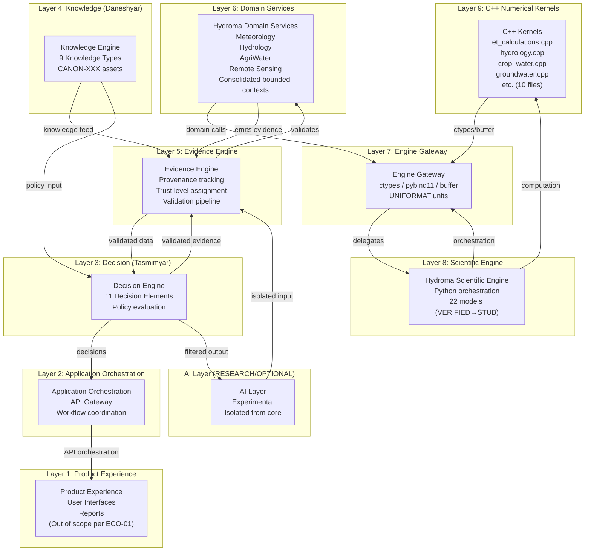

# Diagram 1: Layered Architecture

```mermaid
graph TD
    subgraph "Layer 9: C++ Numerical Kernels"
        A["C++ Kernels<br/>et_calculations.cpp<br/>hydrology.cpp<br/>crop_water.cpp<br/>groundwater.cpp<br/>etc. (10 files)"]
    end
    
    subgraph "Layer 8: Scientific Engine"
        B["Hydroma Scientific Engine<br/>Python orchestration<br/>22 models (VERIFIED→STUB)"]
    end
    
    subgraph "Layer 7: Engine Gateway"
        C["Engine Gateway<br/>ctypes / pybind11 / buffer<br/>UNIFORMAT units"]
    end
    
    subgraph "Layer 6: Domain Services"
        D["Hydroma Domain Services<br/>Meteorology<br/>Hydrology<br/>AgriWater<br/>Remote Sensing<br/>Consolidated bounded contexts"]
    end
    
    subgraph "Layer 5: Evidence Engine"
        E["Evidence Engine<br/>Provenance tracking<br/>Trust level assignment<br/>Validation pipeline"]
    end
    
    subgraph "Layer 4: Knowledge (Daneshyar)"
        F["Knowledge Engine<br/>9 Knowledge Types<br/>CANON-XXX assets"]
    end
    
    subgraph "Layer 3: Decision (Tasmimyar)"
        G["Decision Engine<br/>11 Decision Elements<br/>Policy evaluation"]
    end
    
    subgraph "Layer 2: Application Orchestration"
        H["Application Orchestration<br/>API Gateway<br/>Workflow coordination"]
    end
    
    subgraph "Layer 1: Product Experience"
        I["Product Experience<br/>User Interfaces<br/>Reports<br/>(Out of scope per ECO-01)"]
    end
    
    subgraph "AI Layer (RESEARCH/OPTIONAL)"
        J["AI Layer<br/>Experimental<br/>Isolated from core"]
    end
    
    A -->|ctypes/buffer| C
    B -->|orchestration| C
    C -->|delegates| B
    B -->|computation| A
    D -->|domain calls| C
    E -->|validates| D
    D -->|emits evidence| E
    F -->|knowledge feed| E
    F -->|policy input| G
    G -->|decisions| H
    G -->|validated evidence| E
    H -->|API orchestration| I
    J -->|isolated input| E
    E -->|validated data| G
    G -->|filtered output| J
```
