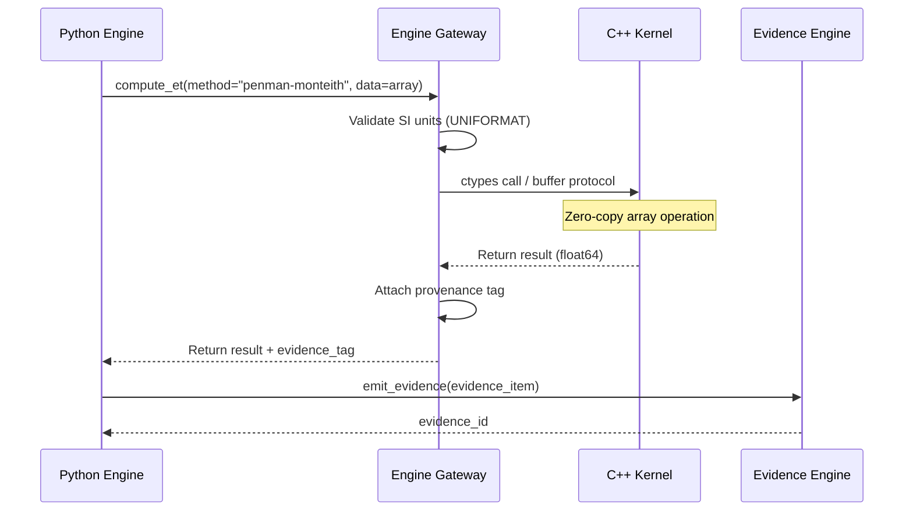

# Diagram 2: C++/Python Boundary Protocol

```mermaid
sequenceDiagram
    participant P as Python Engine
    participant G as Engine Gateway
    participant C as C++ Kernel
    participant E as Evidence Engine
    
    P->>G: compute_et(method="penman-monteith", data=array)
    G->>G: Validate SI units (UNIFORMAT)
    G->>C: ctypes call / buffer protocol
    Note over C: Zero-copy array operation
    C-->>G: Return result (float64)
    G->>G: Attach provenance tag
    G-->>P: Return result + evidence_tag
    P->>E: emit_evidence(evidence_item)
    E-->>P: evidence_id
```
