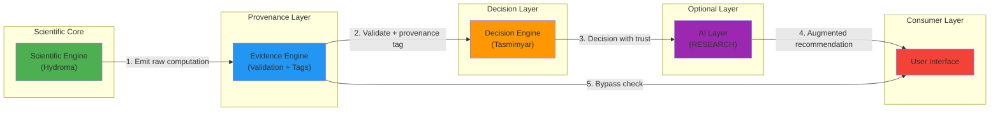

# Diagram 3: Evidence Chain Flow

```mermaid
flowchart LR
    subgraph "Scientific Core"
        SCI["Scientific Engine<br/>(Hydroma)"]
    end
    
    subgraph "Provenance Layer"
        EV["Evidence Engine<br/>(Validation + Tags)"]
    end
    
    subgraph "Decision Layer"
        DEC["Decision Engine<br/>(Tasmimyar)"]
    end
    
    subgraph "Optional Layer"
        AI["AI Layer<br/>(RESEARCH)"]
    end
    
    subgraph "Consumer Layer"
        USR["User Interface"]
    end
    
    SCI -->|1. Emit raw computation| EV
    EV -->|2. Validate + provenance tag| DEC
    DEC -->|3. Decision with trust| AI
    AI -->|4. Augmented recommendation| USR
    EV -->|5. Bypass check| USR
    
    style SCI fill:#4CAF50
    style EV fill:#2196F3
    style DEC fill:#FF9800
    style AI fill:#9C27B0
    style USR fill:#F44336
    
    classDef core fill:#4CAF50;
    classDef evidence fill:#2196F3;
    classDef decision fill:#FF9800;
    classDef research fill:#9C27B0;
```
