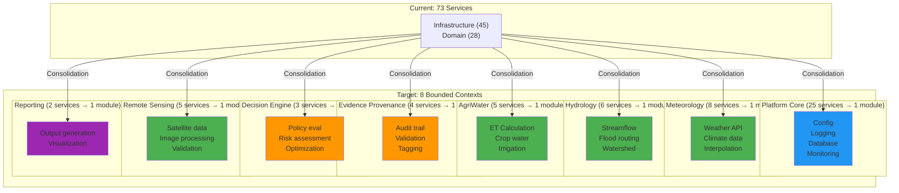

# Diagram 5: Service Consolidation Target

```mermaid
graph TD
    subgraph "Current: 73 Services"
        OLD["Infrastructure (45)<br/>Domain (28)"]
    end
    
    subgraph "Target: 8 Bounded Contexts"
        subgraph "Platform Core (25 services → 1 module)"
            PC["Config<br/>Logging<br/>Database<br/>Monitoring"]
        end
        
        subgraph "Meteorology (8 services → 1 module)"
            MET["Weather API<br/>Climate data<br/>Interpolation"]
        end
        
        subgraph "Hydrology (6 services → 1 module)"
            HYD["Streamflow<br/>Flood routing<br/>Watershed"]
        end
        
        subgraph "AgriWater (5 services → 1 module)"
            AGW["ET Calculation<br/>Crop water<br/>Irrigation"]
        end
        
        subgraph "Evidence Provenance (4 services → 1 module)"
            EVID["Audit trail<br/>Validation<br/>Tagging"]
        end
        
        subgraph "Decision Engine (3 services → 1 module)"
            DEC["Policy eval<br/>Risk assessment<br/>Optimization"]
        end
        
        subgraph "Remote Sensing (5 services → 1 module)"
            RS["Satellite data<br/>Image processing<br/>Validation"]
        end
        
        subgraph "Reporting (2 services → 1 module)"
            REP["Output generation<br/>Visualization"]
        end
    end
    
    OLD -->|"Consolidation"| PC & MET & HYD & AGW & EVID & DEC & RS & REP
    
    style PC fill:#2196F3
    style MET fill:#4CAF50
    style HYD fill:#4CAF50
    style AGW fill:#4CAF50
    style EVID fill:#FF9800
    style DEC fill:#FF9800
    style RS fill:#4CAF50
    style REP fill:#9C27B0
```
