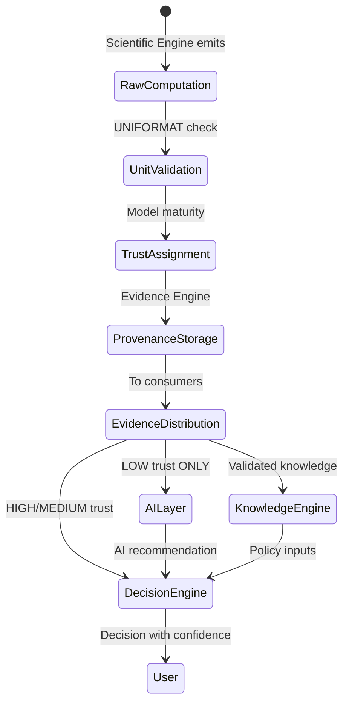

# Diagram 7: Evidence Tag Lifecycle

```mermaid
stateDiagram-v2
    [*] --> RawComputation: Scientific Engine emits
    RawComputation --> UnitValidation: UNIFORMAT check
    UnitValidation --> TrustAssignment: Model maturity
    TrustAssignment --> ProvenanceStorage: Evidence Engine
    ProvenanceStorage --> EvidenceDistribution: To consumers
    EvidenceDistribution --> DecisionEngine: HIGH/MEDIUM trust
    EvidenceDistribution --> AILayer: LOW trust ONLY
    DecisionEngine --> User: Decision with confidence
    AILayer --> DecisionEngine: AI recommendation
    EvidenceDistribution --> KnowledgeEngine: Validated knowledge
    KnowledgeEngine --> DecisionEngine: Policy inputs
```
