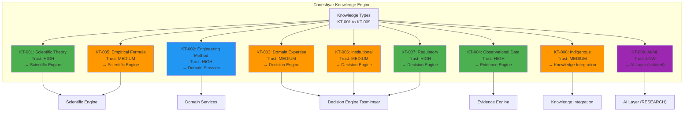

# Diagram 8: Knowledge Integration Flow (Daneshyar)

```mermaid
graph TB
    subgraph "Daneshyar Knowledge Engine"
        DKN["Knowledge Types<br/>KT-001 to KT-009"]
        
        KT001["KT-001: Scientific Theory<br/>Trust: HIGH<br/>→ Scientific Engine"]
        KT002["KT-002: Engineering Method<br/>Trust: HIGH<br/>→ Domain Services"]
        KT003["KT-003: Domain Expertise<br/>Trust: MEDIUM<br/>→ Decision Engine"]
        KT004["KT-004: Observational Data<br/>Trust: HIGH<br/>→ Evidence Engine"]
        KT005["KT-005: Empirical Formula<br/>Trust: MEDIUM<br/>→ Scientific Engine"]
        KT006["KT-006: Institutional<br/>Trust: MEDIUM<br/>→ Decision Engine"]
        KT007["KT-007: Regulatory<br/>Trust: HIGH<br/>→ Decision Engine"]
        KT008["KT-008: Indigenous<br/>Trust: MEDIUM<br/>→ Knowledge Integration"]
        KT009["KT-009: AI/ML<br/>Trust: LOW<br/>→ AI Layer (isolated)"]
    end
    
    DKN --> KT001 & KT002 & KT003 & KT004 & KT005 & KT006 & KT007 & KT008 & KT009
    
    KT001 --> SCI["Scientific Engine"]
    KT002 --> DOM["Domain Services"]
    KT003 --> DEC["Decision Engine Tasmimyar"]
    KT004 --> EV["Evidence Engine"]
    KT005 --> SCI
    KT006 --> DEC
    KT007 --> DEC
    KT008 --> KNOWNGE["Knowledge Integration"]
    KT009 --> AI["AI Layer (RESEARCH)"]
    
    style KT001 fill:#4CAF50
    style KT004 fill:#4CAF50
    style KT007 fill:#4CAF50
    style KT003 fill:#FF9800
    style KT005 fill:#FF9800
    style KT006 fill:#FF9800
    style KT008 fill:#FF9800
    style KT009 fill:#9C27B0
    style KT002 fill:#2196F3
```
