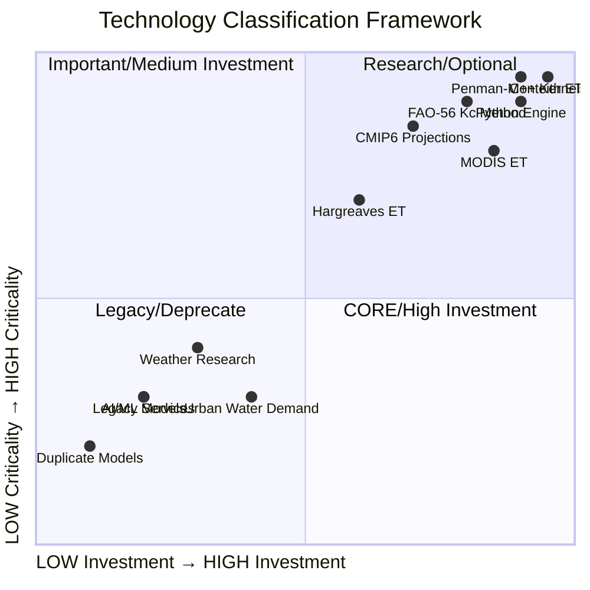

# Diagram 9: Technology Classification Matrix

```mermaid
quadrantChart
    title Technology Classification Framework
    x-axis LOW Investment → HIGH Investment
    y-axis LOW Criticality → HIGH Criticality
    quadrant-1 Research/Optional
    quadrant-2 Important/Medium Investment
    quadrant-3 Legacy/Deprecate
    quadrant-4 CORE/High Investment
    "AI/ML Models": [0.2, 0.3]
    "Weather Research": [0.3, 0.4]
    "Urban Water Demand": [0.4, 0.3]
    "Hargreaves ET": [0.6, 0.7]
    "Penman-Monteith ET0": [0.9, 0.95]
    "FAO-56 Kc Method": [0.8, 0.9]
    "CMIP6 Projections": [0.7, 0.85]
    "MODIS ET": [0.85, 0.8]
    "C++ Kernels": [0.95, 0.95]
    "Python Engine": [0.9, 0.9]
    "Duplicate Models": [0.1, 0.2]
    "Legacy Services": [0.2, 0.3]
```
