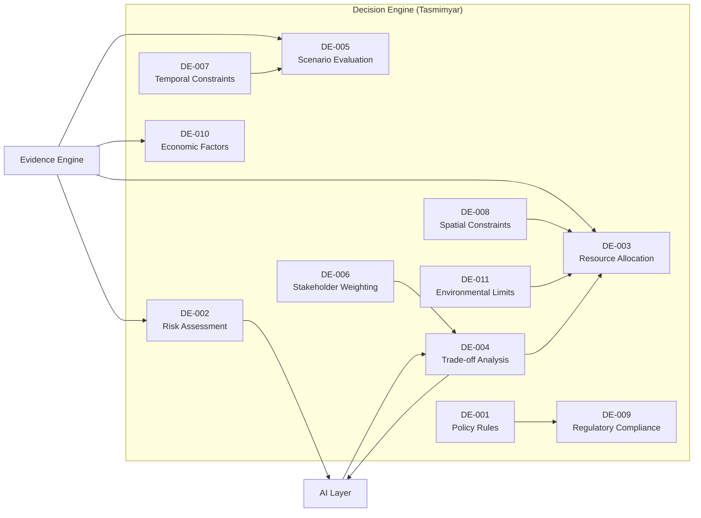

# Diagram 10: Decision Element Relationships

```mermaid
graph LR
    subgraph "Decision Engine (Tasmimyar)"
        DE001["DE-001<br/>Policy Rules"]
        DE002["DE-002<br/>Risk Assessment"]
        DE003["DE-003<br/>Resource Allocation"]
        DE004["DE-004<br/>Trade-off Analysis"]
        DE005["DE-005<br/>Scenario Evaluation"]
        DE006["DE-006<br/>Stakeholder Weighting"]
        DE007["DE-007<br/>Temporal Constraints"]
        DE008["DE-008<br/>Spatial Constraints"]
        DE009["DE-009<br/>Regulatory Compliance"]
        DE010["DE-010<br/>Economic Factors"]
        DE011["DE-011<br/>Environmental Limits"]
    end
    
    EV["Evidence Engine"]
    AI["AI Layer"]
    
    EV --> DE002 & DE003 & DE005 & DE010
    DE006 --> DE004
    DE001 --> DE009
    DE007 --> DE005
    DE008 --> DE003
    DE011 --> DE003
    DE004 --> DE003
    
    DE002 --> AI
    DE004 --> AI
    AI --> DE004
```
