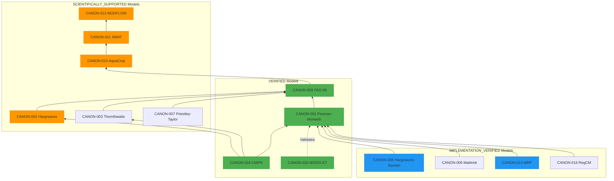

# Diagram 11: Model Dependency Hierarchy

```mermaid
graph BT
    subgraph "VERIFIED Models"
        A["CANON-001 Penman-Monteith"]
        B["CANON-009 FAO-56"]
        C["CANON-018 CMIP6"]
        D["CANON-020 MODIS ET"]
    end
    
    subgraph "SCIENTIFICALLY_SUPPORTED Models"
        E["CANON-002 Hargreaves"]
        F["CANON-003 Thornthwaite"]
        G["CANON-007 Priestley-Taylor"]
        H["CANON-010 AquaCrop"]
        I["CANON-011 SWAT"]
        J["CANON-013 MODFLOW"]
    end
    
    subgraph "IMPLEMENTATION_VERIFIED Models"
        K["CANON-005 Hargreaves-Samani"]
        L["CANON-006 Makkink"]
        M["CANON-014 WRF"]
        N["CANON-016 RegCM"]
    end
    
    A --> B
    C --> A & E & F
    D -. Validates .-> A
    E --> B
    F --> B
    G --> B
    B --> H
    H --> I
    I --> J
    K --> A
    L --> A
    M --> A
    N --> A
    
    style A fill:#4CAF50,stroke:#388E3C
    style B fill:#4CAF50,stroke:#388E3C
    style C fill:#4CAF50,stroke:#388E3C
    style D fill:#4CAF50,stroke:#388E3C
    style E fill:#FF9800,stroke:#F57C00
    style H fill:#FF9800,stroke:#F57C00
    style I fill:#FF9800,stroke:#F57C00
    style J fill:#FF9800,stroke:#F57C00
    style K fill:#2196F3,stroke:#1976D2
    style M fill:#2196F3,stroke:#1976D2
```
