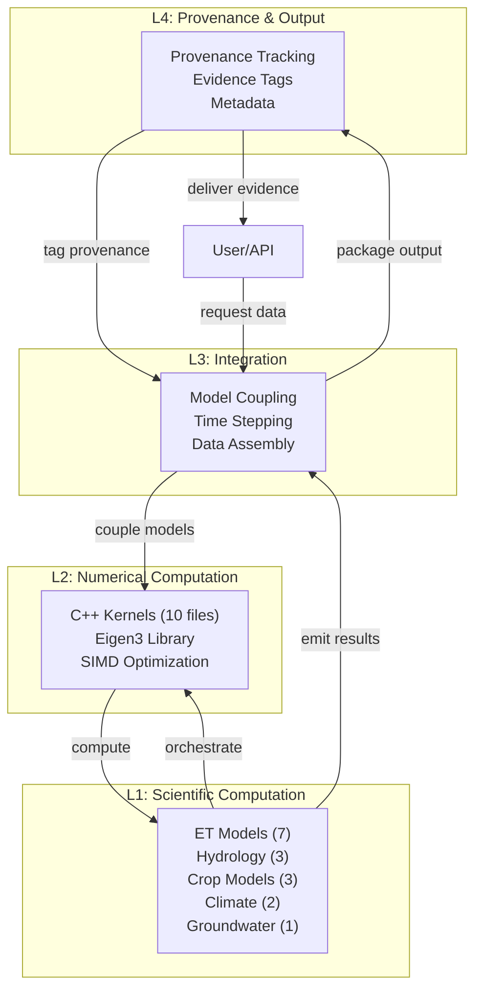

# Diagram 12: Hydroma 4-Layer Deep Dive

```mermaid
graph TD
    subgraph "L4: Provenance & Output"
        L4A["Provenance Tracking<br/>Evidence Tags<br/>Metadata"]
    end
    
    subgraph "L3: Integration"
        L3A["Model Coupling<br/>Time Stepping<br/>Data Assembly"]
    end
    
    subgraph "L2: Numerical Computation"
        L2A["C++ Kernels (10 files)<br/>Eigen3 Library<br/>SIMD Optimization"]
    end
    
    subgraph "L1: Scientific Computation"
        L1A["ET Models (7)<br/>Hydrology (3)<br/>Crop Models (3)<br/>Climate (2)<br/>Groundwater (1)"]
    end
    
    L1A -->|"orchestrate"| L2A
    L2A -->|"compute"| L1A
    L1A -->|"emit results"| L3A
    L3A -->|"couple models"| L2A
    L3A -->|"package output"| L4A
    L4A -->|"tag provenance"| L3A
    
    USR["User/API"] -->|"request data"| L3A
    L4A -->|"deliver evidence"| USR
```
