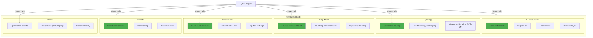

# Diagram 13: C++ Kernel Architecture

```mermaid
graph TD
    subgraph "C++ Kernel Suite"
        subgraph "ET Calculations"
            ET1["Penman-Monteith"]
            ET2["Hargreaves"]
            ET3["Thornthwaite"]
            ET4["Priestley-Taylor"]
        end
        
        subgraph "Hydrology"
            HY1["Streamflow Routing"]
            HY2["Flood Routing (Muskingum)"]
            HY3["Watershed Modeling (SCS-CN)"]
        end
        
        subgraph "Crop Water"
            CW1["FAO-56 Crop Coefficient"]
            CW2["AquaCrop Implementation"]
            CW3["Irrigation Scheduling"]
        end
        
        subgraph "Groundwater"
            GW1["MODFLOW Interface"]
            GW2["Groundwater Flow"]
            GW3["Aquifer Recharge"]
        end
        
        subgraph "Climate"
            CL1["Climate Interpolation"]
            CL2["Downscaling"]
            CL3["Bias Correction"]
        end
        
        subgraph "Utilities"
            UT1["Optimization (Pareto)"]
            UT2["Interpolation (IDW/Kriging)"]
            UT3["Statistics Library"]
        end
    end
    
    PY["Python Engine"] -->|"ctypes calls"| ET1 & HY1 & CW1 & GW1 & CL1 & UT1
    
    style ET1 fill:#4CAF50
    style HY1 fill:#4CAF50
    style CW1 fill:#4CAF50
    style GW1 fill:#4CAF50
    style CL1 fill:#4CAF50
```
