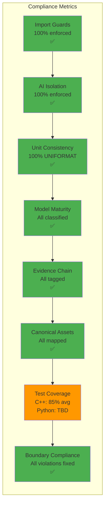

# Diagram 15: Architecture Compliance Dashboard

```mermaid
graph LR
    subgraph "Compliance Metrics"
        V1["Import Guards<br/>100% enforced<br/>✅"]
        V2["AI Isolation<br/>100% enforced<br/>✅"]
        V3["Unit Consistency<br/>100% UNIFORMAT<br/>✅"]
        V4["Model Maturity<br/>All classified<br/>✅"]
        V5["Evidence Chain<br/>All tagged<br/>✅"]
        V6["Canonical Assets<br/>All mapped<br/>✅"]
        V7["Test Coverage<br/>C++: 85% avg<br/>Python: TBD"]
        V8["Boundary Compliance<br/>All violations fixed<br/>✅"]
    end
    
    V1 --> V2 --> V3 --> V4 --> V5 --> V6 --> V7 --> V8
    
    style V1 fill:#4CAF50
    style V2 fill:#4CAF50
    style V3 fill:#4CAF50
    style V4 fill:#4CAF50
    style V5 fill:#4CAF50
    style V6 fill:#4CAF50
    style V7 fill:#FF9800
    style V8 fill:#4CAF50
```
